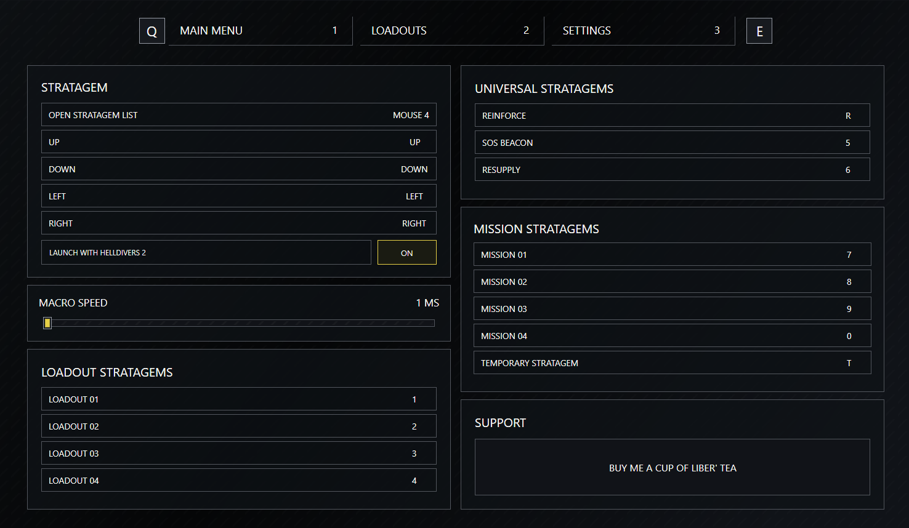
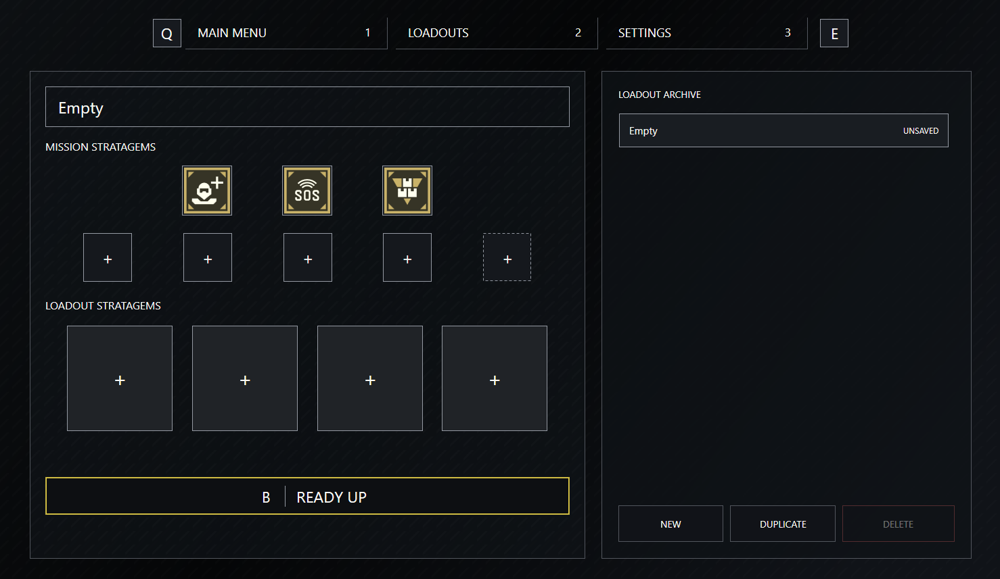

# Vanguard


**Vanguard** is a Windows desktop companion for **Helldivers 2** that helps you build stratagem loadouts, assign macro keys, and use **stratagems** faster.

It is designed for players who want the strengths of using macros for stratagems but not the fuss of the other programs

---

## Download


<p align="center">
  <a href="https://github.com/TomBIOI/Vanguard/raw/refs/heads/main/Releases/Vanguard-1.0.1.msi">
    
  </a>
</p>


### Manual Download

1. Open the **Releases** page for this repository.
2. Download the latest installer named  `Vanguard-x.y.z-.msi`.
3. Run the installer.
4. Launch **Vanguard** from the Start menu.

If you are updating from an older version, just install the new MSI over the top. If Windows keeps an older broken shortcut around, uninstall the old version first and then install the latest release.

As I am not a known publisher, the installer will be prevented by Microsoft Defender SmartScreen. Press `more info` and then `run anyway`.

---

## What Vanguard Does

- Creates and saves stratagem loadouts.
- Lets you assign macro keys to mission and loadout stratagems.
- Supports normal macro mode and instant macro mode.
- Can auto-open with **Helldivers 2** if that option is enabled in the **settings**.
- Saves your configuration locally so your loadouts persist between sessions.

Vanguard does **not** edit or access Helldivers 2 game files.

---

# Vanguard in action


This is the **instant** macro mode, no need to hold the open strategem menu


This is the **normal** mode, will only activate if the open strategem keybind is press, allowing you to use keys that are used in game for other actions such as `R` for reload

---

## How It Works

### 1. Set Your Input Bindings


In the **Settings** section, configure the keys Vanguard should use for:

- Opening the stratagem list
- Up / Down / Left / Right inputs
- Universal strategem macros
- Mission stratagem macros
- Personal loadout macros

---

### 2. Build a Loadout


In the **Loadouts** section, choose the stratagems you want in each slot and name your loadout however you like.

Select the loadout you want to use, then press **READY UP**. Vanguard saves that setup as your active configuration.

---

### 3. Use It In Game

When macros are enabled:

- In normal mode, hold your stratagem-open key and then press the assigned macro key.
- In instant mode, press the assigned macro key directly.

Vanguard will play the code for the selected stratagem.

---

### 4. Optional: Open With Helldivers 2

If **Launch with Helldivers 2** is turned on, Vanguard can watch for the game starting and open itself automatically.

---

## Requirements

- Windows x64
- Helldivers 2

---

## Saved Data

Vanguard stores its own settings here:

```text
%LOCALAPPDATA%\Vanguard\settings.json
```

Crash and integration logs are written here:

```text
%LOCALAPPDATA%\Vanguard\logs\
```

This is useful if you want to back up your loadouts or troubleshoot a launch issue.

---

## Troubleshooting

### Vanguard does not open

- Make sure you are using the latest release.
- Reinstall the latest MSI.
- If you installed an older broken build previously, uninstall it first and then install the newest one.
- Check `%LOCALAPPDATA%\Vanguard\logs\crash.log`.

### Open with Helldivers 2 is not working

- Make sure the setting is enabled inside Vanguard.
- Launch Vanguard once after installation so it can save your preference.
- Check `%LOCALAPPDATA%\Vanguard\logs\integration.log`.

### My settings disappeared

- Check whether `%LOCALAPPDATA%\Vanguard\settings.json` still exists.
- If you are moving to a new PC, copy that file to keep your loadouts and bindings.

---

## Support

If you run into a bug, open an issue in this repository and include:

- What happened
- What you expected to happen
- Your Vanguard version
- Anything useful from `crash.log` or `integration.log`

You can also email `helldivers-vanguard@gmail.com` with any questions and feedback.

---

## Donate

If you would like to support this project, please follow the link below:

<p align="center">
  <a href="https://www.buymeacoffee.com/helldivers_vanguard">
    
  </a>
</p>
